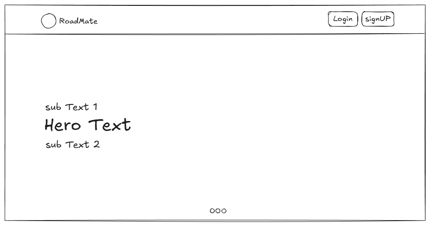
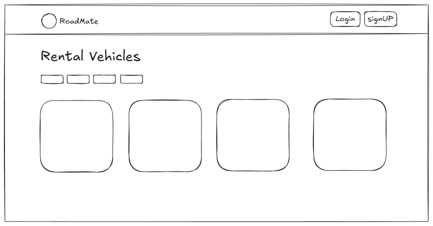
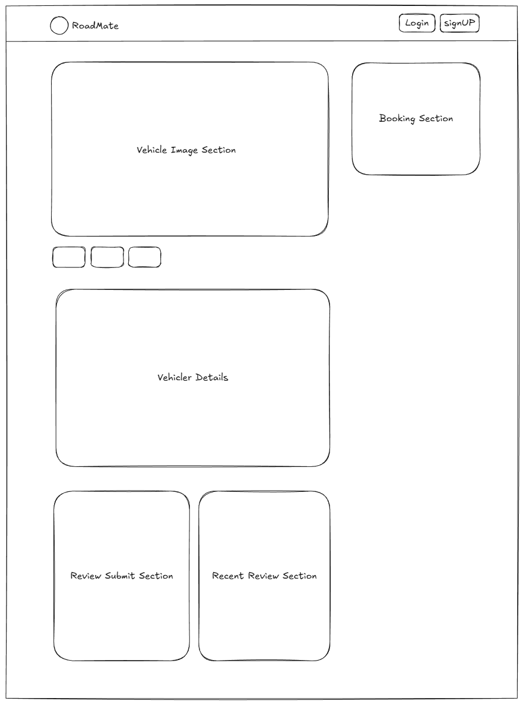
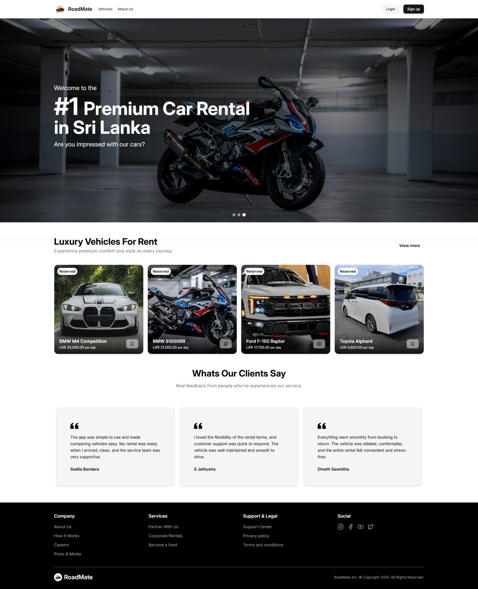
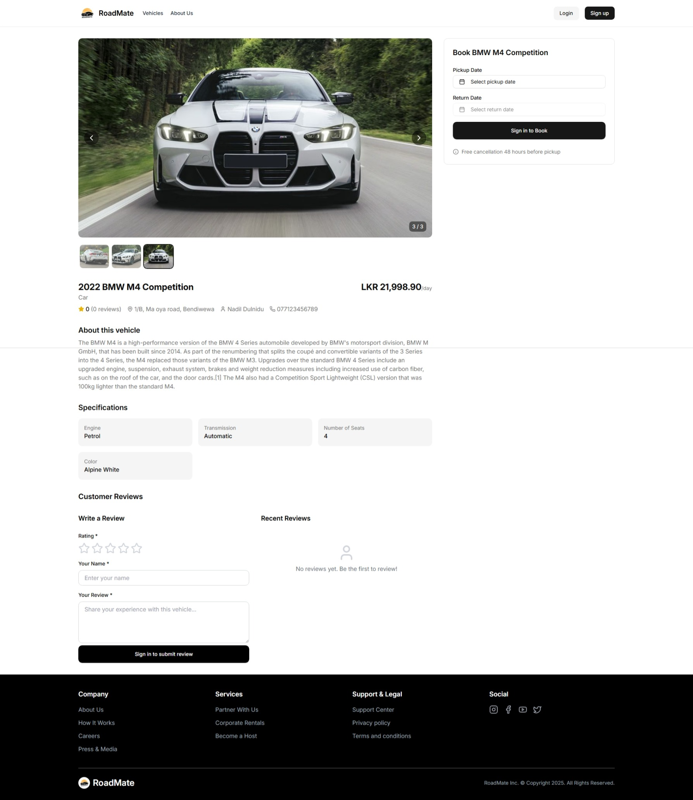
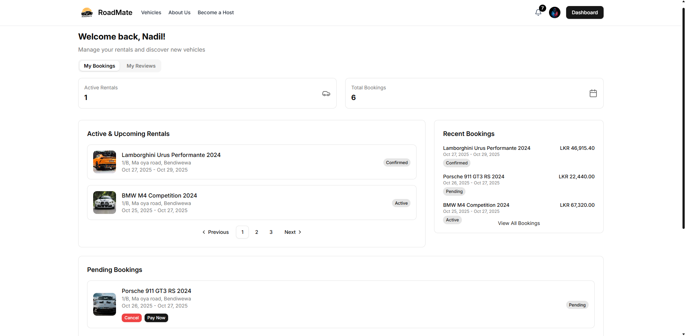
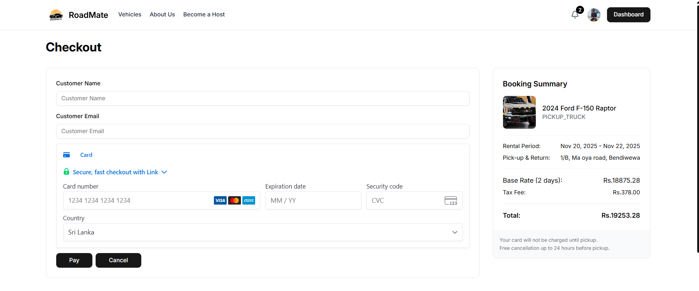
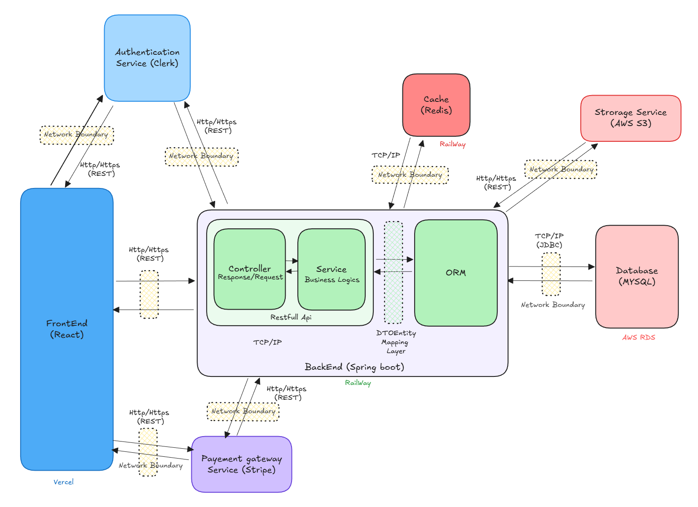
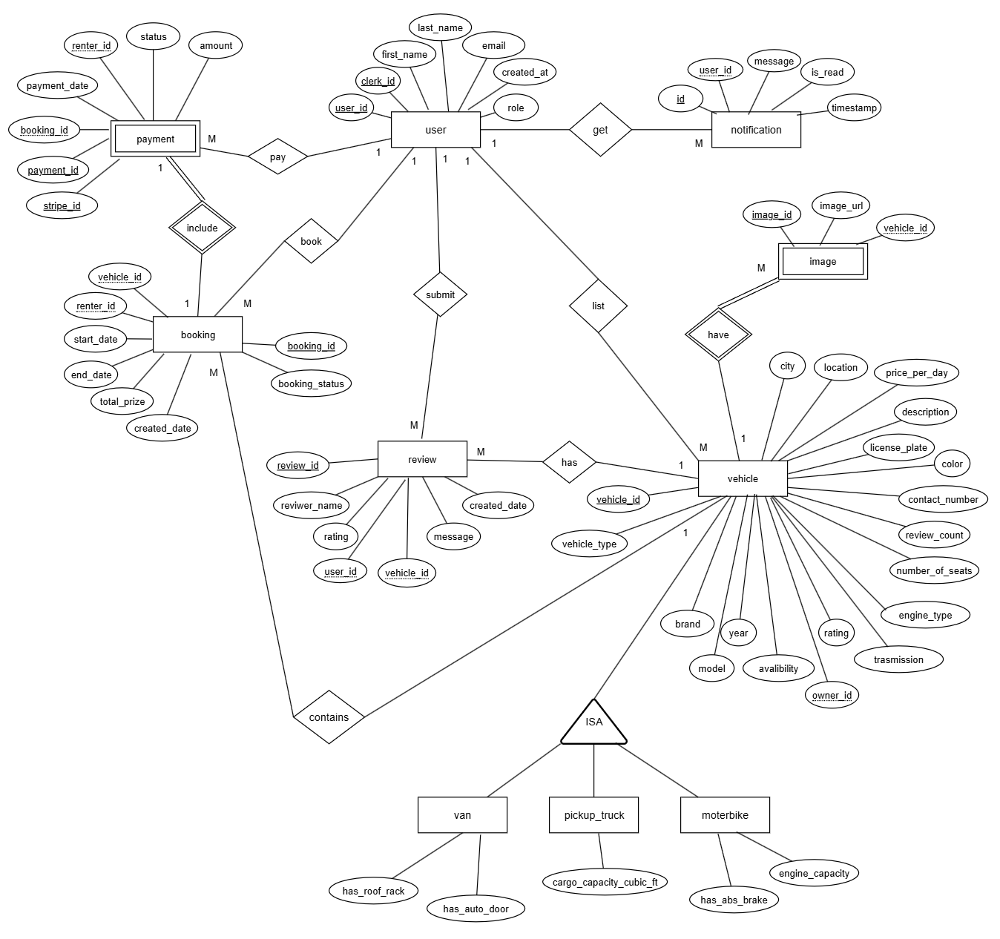
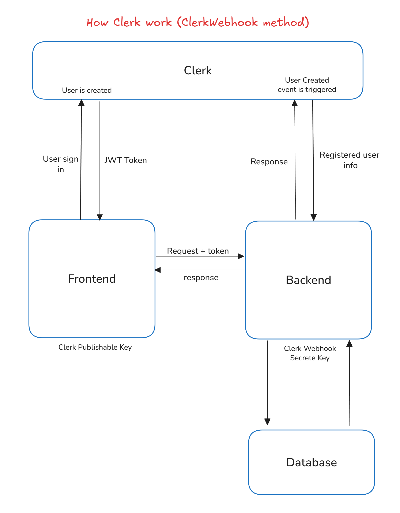

# 🚗 RoadMate - Vehicle Rental System

RoadMate is a modern, secure, and user-friendly web-based Vehicle Rental Platform built to streamline the vehicle renting experience for both renters and vehicle owners. It provides a centralized digital environment where users can browse vehicles, book rentals, manage bookings, and securely handle payments. RoadMate leverages modern technologies including Spring Boot, Clerk for authentication, Stripe for payments, and a scalable cloud-ready architecture.

## 🤔 Problem Space
### Problems to Solve / Requirements to Create

RoadMate aims to modernize the traditional rental process—which is often manual, unreliable, and inefficient—by providing:

* A centralized online marketplace for renting vehicles
* Secure payments
* Automated booking and notifications
* A transparent review and rating system

However, building such a platform introduces several challenges.

### 👉 Problem: Unstructured & Manual Vehicle Rental Processes

#### Problem Statement:
Traditional rental processes rely on manual communication, phone calls, and outdated spreadsheets. This causes delays, frequent miscommunication, and poor customer satisfaction.

#### Current Solution:
RoadMate provides a fully digital rental flow including browsing, filtering, vehicle availability calendars, renter–owner communication, and automated confirmations.

#### How do we know it is a problem?

* User Feedback: Renters complain about inconsistent communication with owners.
* Metrics: Manual systems result in frequent double-bookings and missing records.
* Evidence: Vehicle owners often maintain spreadsheets or WhatsApp logs to track bookings.

### 👉 Problem: Payment Handling & Lack of Trust

#### Problem Statement:
Cash-based or unverified payments lead to high cancellation rates, disputes, and lack of accountability.

#### Current Solution:
RoadMate integrates Stripe Payment Gateway for secure, PCI-compliant, and traceable payments.

#### How do we know it is a problem?

* User Reports: Renters hesitate to pay upfront without secure digital transactions.
* Metrics: Vehicle owners face 30–40% cancellation when payments aren't confirmed.
* Evidence: Stripe logs show improved confirmation rates when secure checkout is used.

### 👉 Problem: User Authentication & Role-Based Access

#### Problem Statement:
Managing multiple user roles (Admin, Staff, Owner, Renter) securely while maintaining accurate permission controls is complex.

#### Current Solution:
RoadMate uses Clerk Authentication with RBAC (Role-Based Access Control) for secure, scalable identity management.

#### How do we know it is a problem?

* Logs: Unauthorized access attempts due to weak role separation in early prototypes.
* User Issues: Owners accessing staff pages; renters viewing restricted content.

### ⭐ Why Solve These Problems?

*Reason 1*: Digitalizing vehicle rental operations reduces delays, increases transparency, and improves user satisfaction.

*Reason 2*: Secure authentication and payment processing builds trust and reduces cancellations, disputes, and fraud.

## 🎯 Project Goals
#### Company Objective

Build a scalable, modern, and secure online vehicle rental system for Sri Lanka’s growing digital mobility market.

#### Project Goals

* Develop a web-based rental platform with secure authentication (Clerk).
* Enable vehicle owners to list and manage vehicles.
* Implement a booking calendar with real-time availability.
* Integrate Stripe for secure payments.
* Provide renters with detailed listings, filters, and transparent feedback.
* Build a user-friendly staff and admin management workflow.

## 👥 User Stories
### User Type: Renter (Customer)

**Goals:**
* Search and book suitable vehicles quickly and securely.
  **Needs:**
* View detailed listing info, availability calendar, and pricing.
* Make payments securely.
  **Characteristics:**
* Occasional or regular renters; may require vehicles for travel, business, or emergencies.

### User Type: Vehicle Owner

**Goals:**
* List vehicles, manage availability, and earn income.
  **Needs:**
* Tools to upload images, set rental rules, and approve bookings.
  **Characteristics:**
* Individual owners or small businesses with several vehicles.

### User Type: Staff/Admin

**Goals:**
* Manage operational tasks like handovers and status updates.
* Oversee platform operations and manage user accounts.
  **Needs:**
* Clear access control to update vehicle status and respond to inquiries.
* Tools for dispute resolution, system monitoring, and analytics.

## 🌟 Design Space
### UI Design
The UI design focuses on creating a seamless user experience, emphasizing easy navigation and intuitive interactions. Key features include:

RoadMate follows a clean, intuitive, and mobile-responsive design with:
* Modern dashboards
* Simple navigation
* Consistent layout across user roles
* Clear booking and availability flow

#### User Flow
Renter Flow
* Sign in / Sign up
* Browse & filter vehicles
* View vehicle details + availability
* Book → Pay via Stripe
* Receive confirmation
* Leave feedback after rental

Owner Flow
* Sign in / Sign up
* Become a member
* Create vehicle listings
* Manage calendar availability
* Review booking requests
* Approve / reject requests
* Track earnings

Staff/Admin Flow
* Manage bookings → oversee system → ensure compliance

### Low-Fidelity Wireframe Concepts

Homepage: Search bar, vehicle categories, featured listings
    

Vehicle Listing Page: Grid of vehicles with filters

Vehicle Profile Page: Full details + availability calendar

### High-fidelity design

HomePage Design

Vehicle Profile Page Design

Renter Dashboard Design

Vehicle Owner Dashboard Design

Checkout Page Design

### Design System 🎨

#### ShadCN UI as the Design System

For this project, ShadCN UI was used as the primary design system to build a consistent, modern, and scalable user interface. ShadCN provides a collection of high-quality, accessible components built on top of Radix UI and styled with Tailwind CSS, making it an excellent fit for a frontend built with React and TypeScript.

#### How ShadCN Was Utilized

ShadCN UI was integrated into the project to:

* Build reusable UI components like buttons, forms, cards, modals, dropdowns, and navigation bars.
* Maintain consistency in typography, spacing, colors, and interactions using Tailwind utility classes.
* Customize components directly within the project, allowing fine-tuned control over styles without relying on external library updates.
* Improve user experience with polished and well-structured UI patterns that align with modern standards.

Using ShadCN UI helped accelerate development and ensured the application maintains a professional, cohesive look throughout all user-facing pages.

## 🏗️ Development Phase

### Technology Stack Selection

#### Frontend - React.js with RTK Query

#### Why React.js?
* **Component-Based Architecture:** Enables reusable UI components, making the frontend modular and maintainable.
* **Efficient UI Updates:** Uses a virtual DOM for faster rendering and smooth user interactions.
* **Rich Ecosystem:** Vast library support and active community ensure continued improvements.

#### Why RTK Query for Data Fetching?

* **Efficient Data Fetching:** RTK Query simplifies data fetching with minimal boilerplate code. It streamlines API integration for actions like searching for hotels, fetching hotel details, or managing bookings, which improves the overall development speed.
* **Automatic Caching:** RTK Query automatically caches data and only refetches when required, which improves performance by reducing redundant API calls, especially when displaying static hotel information or previously searched results.
* **Optimized for Redux**: As part of the Redux Toolkit, RTK Query integrates seamlessly with Redux, providing a structured and powerful way to handle server-side data fetching while maintaining consistent application state.
* **Error Handling & Retries:** RTK Query comes with built-in error handling and retry logic for failed API calls, ensuring a more resilient user experience, especially during peak times or unstable network conditions.

#### Backend - Spring Boot

#### Why Spring Boot?

* **Rapid Development:** Spring Boot simplifies backend development with its opinionated configuration and auto-setup features. This allows developers to focus more on business logic rather than boilerplate setup, speeding up development for applications like vehicle rental systems.
* **Scalable Architecture:** Spring Boot is built on top of the Spring framework, making it suitable for scalable, production-grade enterprise applications. Its modular structure ensures the system can grow as your project requirements expand.
* **Built-in Tools & Integrations:** With features like Spring Data JPA, Security, Validation, Scheduling, and easy database connectivity, Spring Boot accelerates implementation of complex backend features such as authentication, bookings, payments, and user management.
* **REST API Ready:** Spring Boot makes it extremely easy to create clean, well-structured REST APIs. This is ideal for modern applications where the backend communicates with a frontend built using React, Next.js, or mobile apps.
* **High Performance & Stability:** Its embedded servers (like Tomcat, Undertow), efficient dependency management, and production-focused optimizations make Spring Boot reliable and performant. Combined with caching (e.g., Redis), it enhances system responsiveness and reduces load times.
* **Large Ecosystem & Community Support:** Spring Boot has extensive documentation, thousands of community libraries, and long-term industry adoption. This ensures continuous improvements, security patches, and a strong support ecosystem.

#### User Authentication - Clerk Authentication

#### Why Clerk Authentication?

* **Built-in User Management:** Clerk provides a comprehensive authentication system that includes sign-ups, logins, and secure session management out of the box, which saves time and effort in building custom solutions.
* **Integration with Modern Apps:** Clerk’s easy integration with React allows for seamless authentication flows, making it a good choice for Horizone’s needs.
* **Security and Compliance:** Clerk ensures security features like password hashing and multi-factor authentication, which are critical for safeguarding sensitive user data.

#### Payment Gateway - Stripe

#### Why Stripe for Payments?

* **Developer-Friendly & Easy Integration:** Stripe offers one of the most intuitive and well-documented APIs available. Its SDKs and step-by-step guides make integrating secure payments into web applications fast and hassle-free.

* **Secure & PCI-Compliant:** Stripe handles sensitive payment information on your behalf, ensuring full PCI compliance. This reduces your security burden while guaranteeing safe handling of customer card data.

* **Supports Multiple Payment Methods:** From credit/debit cards to digital wallets like Apple Pay and Google Pay, Stripe provides a wide range of payment options—helpful for users who prefer different ways to pay for vehicle rentals.

* **Real-Time Webhooks & Events:** Stripe’s webhook system enables real-time tracking of events like successful payments, refunds, or cancellations—making it simple to automate booking confirmations or invoice generation.

* **Transparent Pricing:** Stripe uses a clear, pay-as-you-go pricing model with no hidden fees, which is ideal for startup-scale applications where cost-efficiency matters.

### High-Level Architecture Diagram

Below is a high-level diagram illustrating the architecture of the Web-based Vehicle Rental System. It shows the key components and the flow of information between them.

### Entity-Extended Relationship Diagram

### Development Workflow

#### Frontend (React.js + TypeScript + Tailwind CSS)

The frontend is built using React.js with TypeScript, ensuring robust type safety, better maintainability, and improved developer experience. Users can browse vehicles, manage bookings, complete payments, and interact with all features of the platform through a fast and intuitive UI.

* **React.js** provides a component-based architecture and efficient UI rendering through the virtual DOM.
* **TypeScript** adds static typing, minimizing runtime errors and enabling scalable code as the application grows.
* **Tailwind CSS** ensures a modern, responsive design system with utility-first styling, making the interface consistent, customizable, and mobile-friendly.

The frontend communicates with the backend using secure RESTful APIs, fetching data related to vehicles, users, bookings, payments, and authentication.

#### Backend (Spring Boot)

The backend core is powered by Spring Boot, managing all business logic, security, and API processing for the platform.

* **RESTful API Layer**: Handles vehicle listings, user accounts, bookings, payments, and authentication workflows.
* **Spring Security**: Ensures secure access control, token handling, and user authentication (optionally integrated with Clerk/Auth0/JWT).
* **Spring Data JPA**: Simplifies database interactions with MySQL, reducing boilerplate code.
* **Service Layer**: Manages core business features such as rental calculations, payment processing, vehicle availability checks, and booking logic.

Spring Boot’s modular architecture allows the system to scale efficiently and ensures maintainable, production-ready backend development.

#### Caching Layer (Redis)

Redis is integrated to improve the platform’s performance and reduce server load.

* **Caching frequently accessed data** (vehicle lists, availability status, user sessions, featured vehicles).
* Reduces MySQL queries by serving cached results whenever possible.
* Improves response times, especially during high traffic operations such as search, filtering, or repeated lookups.
* Helps with session management or temporary data storage for features like login, rate limiting, or booking workflows.

This results in a significantly faster and more responsive user experience.

#### Database (MySQL)

MySQL is used as the main relational database for storing structured and consistent data.

* Stores users, vehicles, bookings, payments, reviews, transaction logs, and other critical information.
* Works seamlessly with Spring Data JPA for efficient CRUD operations.
* Ensures data integrity through relationships, constraints, and transaction support.
* Suitable for enterprise-level workloads where consistency, scalability, and reliability are essential.

The combination of MySQL and Spring Boot ensures reliable backend operations and long-term platform stability.

#### Storage Service (AWS S3)

The platform uses Amazon S3 (Simple Storage Service) to store and manage all vehicle images uploaded by admins. S3 provides highly scalable, secure, and durable object storage, making it ideal for handling media files in production-grade applications.

* **Optimized for Large Files:** Perfect for image storage, S3 is built to efficiently handle large objects and high-volume media requests without affecting backend performance.
* **Scalable Storage:** Automatically scales without requiring infrastructure management, making it ideal for growing platforms with increasing vehicle listings.
* **Secure Access Control:** Using IAM roles, pre-signed URLs, and bucket policies, S3 ensures secure upload and retrieval of images. Only authorized services or users can store or access vehicle images.

The integration of S3 ensures efficient image handling while reducing backend load and improving overall frontend performance when displaying vehicle images.

### Key Features of the Software

#### Vehicle Listing & Search

* Owners create/edit/delete listings
* Renters filter by type, price, location
* Detailed view with photos and features

#### Booking System
* Interactive availability
* After Payment Confirmation booking finalization
* Automatic prevention of double-booking

#### Secure Payments (Stripe)
* Hosted checkout page
* Automatic payment confirmation
* Transaction history stored in backend

#### User Management & Authentication (Clerk)
* Sign-up, login, MFA
* Role-based access
* Secure session handling
* Profile management
* User Details Saved in the Database via Webhooks

How Clerk Authentication Integrates with the Database via Webhooks

#### Reviews & Ratings
* Renters rate vehicles after completion
* Publicly displayed average ratings
* Text reviews for transparency

#### Notification System
* In app notification for bookings, payments, reminders
* Auto-generated notifications sent to renters, owners, and staff

## 🚧 Challenges Faced & Solutions
### Problem 1: Role-Based Access Complexity

Solution: Implemented Clerk RBAC, separating user flows and dashboards.

### Problem 2: Preventing Double Bookings

Solution: Calendar-based availability system + server-side validation.

### Problem 3: Payment Security

Solution: Stripe-hosted checkout removes PCI burden and ensures safety.

### Problem 4: Performance Issues

Solution: Backend caching + client-side caching for repeated data requests.